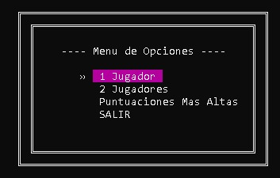
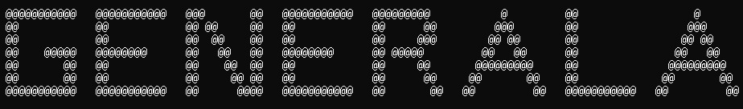

# 🎲 **Generala - Juego de Dados en C++**

Este proyecto implementa una versión de **"Generala"**, un juego de dados, desarrollado en **C++** con una interfaz interactiva en consola. Es el resultado de un trabajo práctico para la materia **Laboratorio 1**.

## 📋 **Descripción**

El juego permite jugar en dos modos:  
- Modo Individual: Un solo jugador intenta alcanzar la mayor cantidad de puntos en un número determinado de rondas.  
- Modo Multijugador: Dos jugadores compiten por turnos para lograr la mayor puntuación.  

### **Características Principales**
1. **Modos de Juego**:  
   - 1 Jugador: El usuario compite contra sí mismo para obtener el mejor puntaje.  
   - 2 Jugadores: Dos usuarios se turnan para competir.  

2. **Gestión de Puntajes**:  
   - Registra y muestra el ranking de los tres mejores puntajes.  
   - Permite anular combinaciones o sumar puntos válidos.  

3. **Generala Servida**:  
   - Si un jugador saca generala servida (todos los dados iguales en el primer tiro), el juego finaliza automáticamente para ese jugador con 50 puntos adicionales.  

4. **Interfaz Gráfica Interactiva**:  
   - Uso de gráficos ASCII para dibujar los dados, bordes, y otros elementos decorativos en la consola.  
   - Navegación fluida en el menú principal con animaciones simples y efectos visuales.  

5. **Opciones de Personalización**:  
   - Posibilidad de cargar los valores de los dados manualmente o generar tiradas aleatorias.  

## 🚀 **Cómo Ejecutar el Proyecto**

### **Prerrequisitos**
- **Compilador C++** compatible con las bibliotecas incluidas (por ejemplo, MinGW, Visual Studio o Code::Blocks).  
- Biblioteca `rlutil.h` para el manejo de la consola y `windows.h` para características específicas de Windows.  

### **Instrucciones**
1. ```bash
   git clone <URL-del-repositorio>
   cd <carpeta-del-repositorio>
2. Compila el programa en tu entorno preferido.
3. Ejecuta el archivo generado y sigue las instrucciones en la consola.

## 🖼️ **Imágenes del Proyecto**

1. **Menú Principal**  
   Muestra las opciones del juego:  
   

2. **Gráficos ASCII del Título "Generala"**  
   Captura que muestra el diseño ASCII del título del juego en la consola:  
   


### 📂 **Estructura del Proyecto**
|-- main.cpp            // Archivo principal con la lógica del programa.
|-- funciones.h         // Funciones auxiliares y gráficas.
|-- jugadores.h         // Gestión de jugadores, puntajes y lógica del juego.
|-- rlutil.h            // Biblioteca para el manejo de la consola.
|-- README.md           // Este archivo.

### 📜 **Notas**
El sistema de puntajes es temporal (no persiste al cerrar el programa).
Si deseas mejorar el proyecto, considera agregar opciones para guardar y cargar los puntajes más altos.
